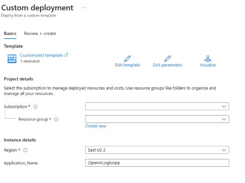
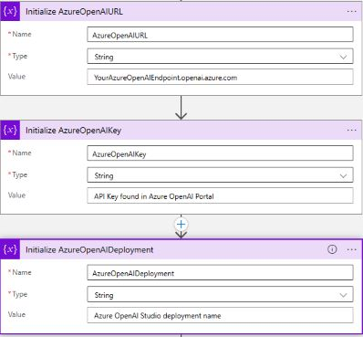
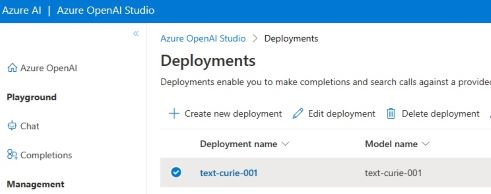
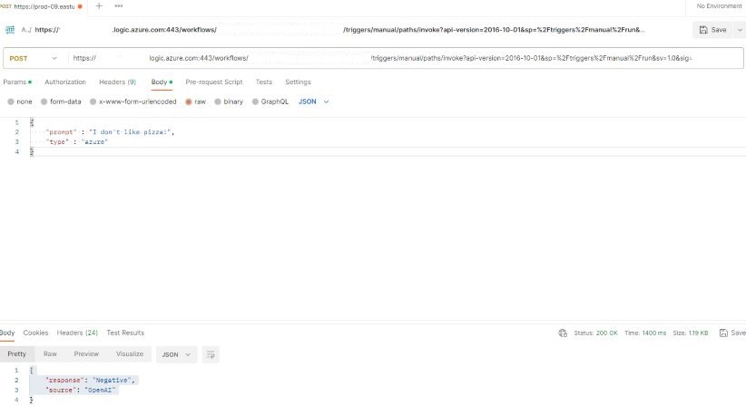

# Logic App Sentiment Analysis

This example demonstrates how to call an Azure Logic App using OpenAI's Completion API or the Azure OpenAI Rest Service to classify the sentiment in a given text.  
[OpenAI API Reference](https://platform.openai.com/docs/api-reference/completions)  
[Azure OpenAI API Reference](https://learn.microsoft.com/en-us/azure/cognitive-services/openai/reference#completions)

## Getting Started

### Prerequisites

* An [Azure subscription](https://azure.microsoft.com/free/)  
* A http querying tool like Postman or curl

To use this example, you will need either an OpenAI account or an Azure OpenAI account  
**OpenAI**
* An [OpenAI account](https://openai.com/)  
[Video on how to open an account](https://www.youtube.com/watch?v=zJSYMWlCcPY)
* API key from the [OpenAI portal](https://platform.openai.com/)  

**Azure OpenAI**
* Azure OpenAI subscription.  Access to the Azure OpenAI portal is by application only.  
Apply for access with this [form](https://aka.ms/oai/access?azure-portal=true)  
* API key from the [Azure OpenAI portal](https://learn.microsoft.com/en-us/azure/cognitive-services/openai/how-to/create-resource?pivots=web-portal#create-a-resource)
* Deployed model to reference in [Azure OpenAI Studio](https://learn.microsoft.com/en-us/azure/cognitive-services/openai/how-to/create-resource?pivots=web-portal#deploy-a-model)

## Usage  
> TODO change link to reference main  

Deploy the Logic App to your Azure subscription.  
[](https://portal.azure.com/#create/Microsoft.Template/uri/https%3A%2F%2Fraw.githubusercontent.com%2Fmicrosoft%2Fglobalopenaihack%2Fsentiment%2Flogicapp%2FOpenAILogicApp%2Fazuredeploy.json)  


1. Set the subscription, resource group, region and name the Logic App.  
  

### OpenAI  
2. Add the OpenAI Key to the Initialize OpenAIKey step.  
  
To find the API Key sign into the portal, and click the user profile in the top right corner  
  
Create and store the new key, you will not be able to retieve the value once the create dialog is closed. 
  

3. Using a tool like Postman, post a query to the url found in the http trigger   
    The body of the request contains a prompt and a type.  The type is set to empty, because this a flow control value for the sample application.  
    ```JSON
    {
        "prompt" : "I don't like pizza!",
        "type" : ""
    }
    ```
      
      
    
    The response sentiment and source value of OpenAI identifies the sample flow condition selected.  
    ```JSON
    {
    "response": "Negative",
    "source": "OpenAI"
    }
    ```  
### Azure OpenAI
2. Add the Azure OpenAI endpoint, Azure OpenAI Key and The Azure OpenAI Studio deployment model name to the initialize steps  
  
  
  

3. Using a tool like Postman, post a query to the url found in the http trigger   
    The body of the request contains a prompt and a type.  The type is set to azure to direct the conditional flow to call the Azure OpenAI endpoint.  
    ```JSON
    {
        "prompt" : "I don't like pizza!",
        "type" : "azure"
    }
    ```  
      
    
    
